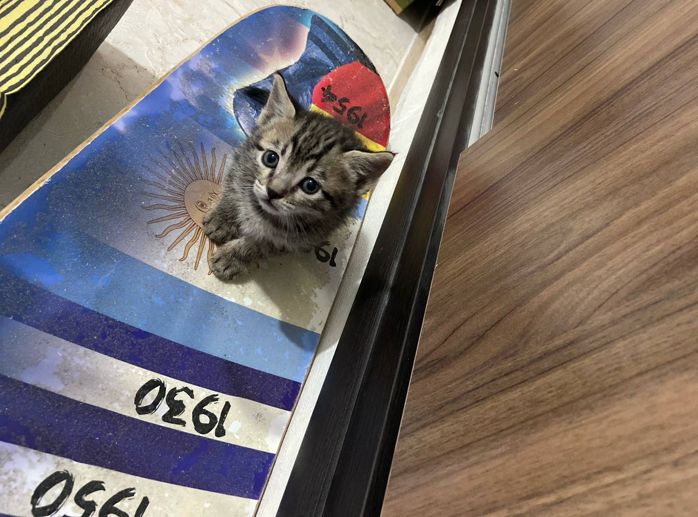
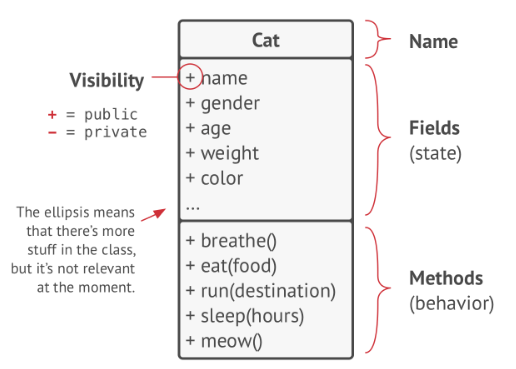
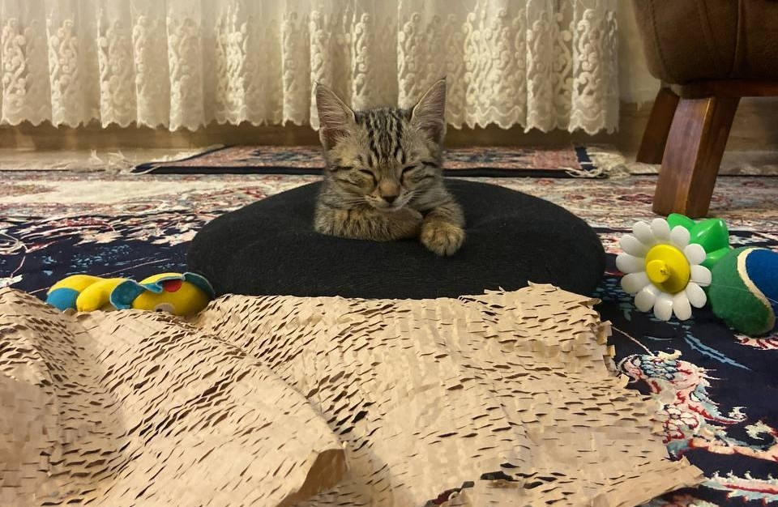
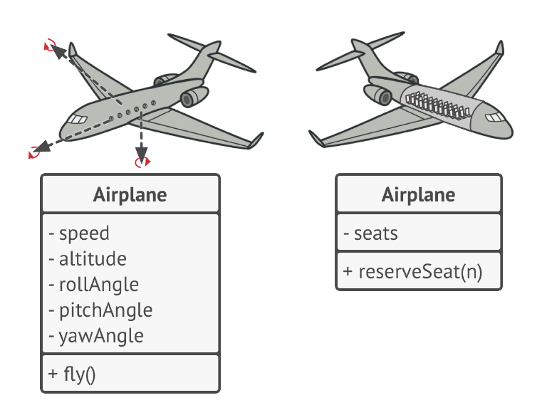
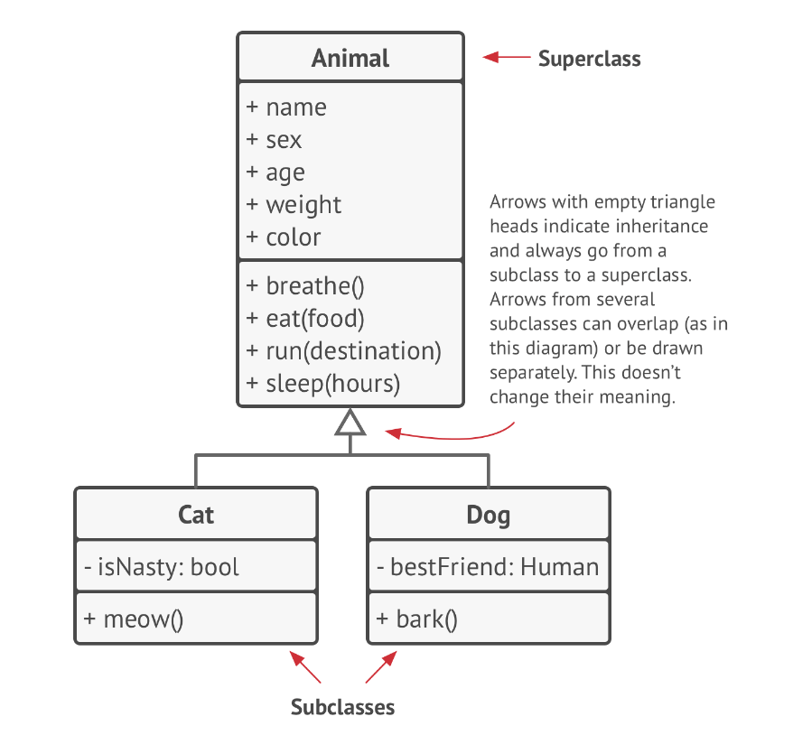
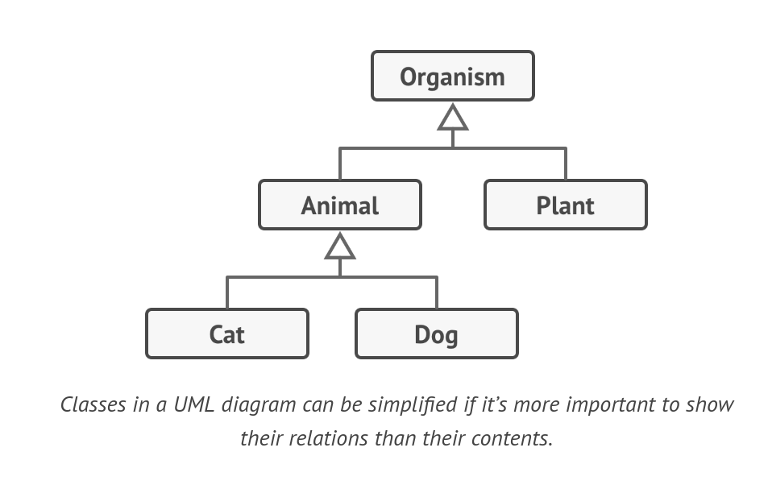
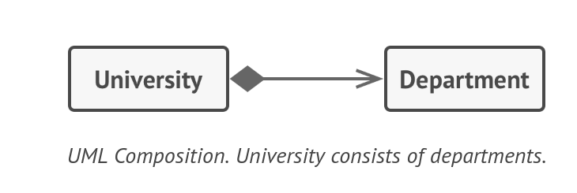
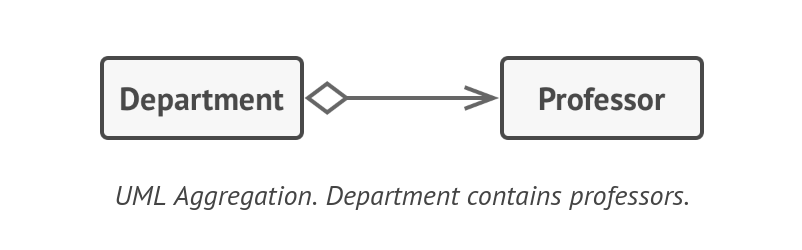

# Object-Oriented Programming – Lesson 0

In this lesson, we introduce the fundamental concepts of Object-Oriented Programming (OOP) and understand why it was created.

## Objectives

- Understand the history of Object-Oriented Programming  
- Identify the limitations of procedural programming  
- Define what a class and an object are  
- Learn the four pillars of OOP  
- Understand relationships between objects  


## Table of Contents

- [History \& Inventors](#history--inventors)
- [The Problem](#the-problem)
  - [The Procedural Approach](#the-procedural-approach)
  - [Data and Operations Are Separate](#data-and-operations-are-separate)
  - [Does It Matter?](#does-it-matter)
- [The Hero Comes: OOP](#the-hero-comes-oop)
  - [What Is a Class?](#what-is-a-class)
  - [Get Help from Sormeh 🐱](#get-help-from-sormeh-)
  - [Modeling with a Diagram](#modeling-with-a-diagram)
  - [Modeling in C++ Code](#modeling-in-c-code)
  - [More Sormeh](#more-sormeh)
- [Pillars of OOP](#pillars-of-oop)
  - [Abstraction](#abstraction)
  - [Encapsulation](#encapsulation)
  - [Inheritance](#inheritance)
  - [Polymorphism](#polymorphism)
- [Relations Between Objects](#relations-between-objects)
  - [Inheritance (Is-A Relationship)](#inheritance-is-a-relationship)
  - [Composition (Has-A Relationship)](#composition-has-a-relationship)
  - [Aggregation](#aggregation)
  - [More Sormeh 🐾](#more-sormeh-)
- [Types of Objects](#types-of-objects)
  - [1. Entity Objects](#1-entity-objects)
  - [2. Boundary Objects](#2-boundary-objects)
  - [3. Controller Objects](#3-controller-objects)
- [MVC Architecture](#mvc-architecture)
  - [Model](#model)
  - [View](#view)
  - [Controller](#controller)
  - [Why MVC?](#why-mvc)
- [Hands-On](#hands-on)
- [Resources](#resources)


## History & Inventors

Built by **Ole-Johan Dahl** and **Kristen Nygaard**.


- **Ole-Johan Dahl (1931–2002):** Implemented the first SIMULA compiler, Turing Award (2001).  
- **Kristen Nygaard (1926–2002):** Turing Award (2001).  

> Dahl and Nygaard created the foundation of OOP, but they did not name it. That credit goes to an American computer scientist: Alan Kay.

**Timeline:**

- 1961–1967: SIMULA developed  
- 1967: First OOP language concepts  
- 1980s: C++  
- 1990s: Java  


## The Problem

Now that you know who invented OOP, let’s answer the more important question: **Why?**

### The Procedural Approach

Let’s say I ask you to write a program that manages a university’s students.

```cpp
int studentIDs[1000];
string studentNames[1000];
float studentGPAs[1000];
```

This can be fixed by grouping related data:

```cpp
struct Student {
    int    id;
    string name;
    float  gpa;
};
```

### Data and Operations Are Separate

In procedural programming:

- No data protection → You cannot fully trust the data.  
- Business rules are not enforced → Anyone can modify the data incorrectly.  

### Does It Matter?

As a programmer? Maybe not.  
As a software engineer? Absolutely.

- You deal with millions of lines of code (Linux kernel ~28M lines).  
- You are part of a team → Thousands of engineers collaborate in large codebases like Windows.  
- You are not a frog → Fixing one bug may create new bugs elsewhere.  

We need better structure, safety, and scalability.


## The Hero Comes: OOP

### What Is a Class?

A class is a blueprint that maps a real-world concept into code.

When you look at anything in the real world, it has two aspects:

- What it **IS** (attributes / properties)  
- What it **DOES** (operations / behaviors)  


### Get Help from Sormeh 🐱



**Attributes:**
- name  
- color  
- age  
- energy  

**Operations:**
- sleep()  
- eat()  
- bite()  

> Service functions define behavior.


### Modeling with a Diagram

A picture speaks a thousand words.




### Modeling in C++ Code

This is how an object is defined. Don’t panic — we will review it in the next sections.

```cpp
class Cat {
private:
    string name;
    string color;
    int age;
    int energyLevel;
    
public:
    // Constructor - special function that runs when object is created
    Cat(string catName, string catColor, int catAge) {
        name = catName;
        color = catColor;
        age = catAge;
        energyLevel = 100;  // New cats start fully energized
    }
    
    void meow() {
        cout << name << " says: Meow!" << endl;
    }
};

int main() {
    Cat cat("Sormeh", "Khal Khaly", 6);
    cat.meow();
}
```


### More Sormeh




## Pillars of OOP

Object-Oriented Programming is based on four pillars:

1. Abstraction  
2. Encapsulation  
3. Inheritance  
4. Polymorphism  


### Abstraction

Objects in a program do not represent real-world entities with 100% accuracy.  
We only model what we need.




### Encapsulation

To start a car engine, you only need to turn a key or press a button.  
You don’t need to connect wires under the hood.

In code, we use:

- `private`  
- `public`  

Encapsulation protects data and controls access.


### Inheritance

Inheritance is the ability to build new classes on top of existing ones.




### Polymorphism

Polymorphism allows objects to behave differently while sharing the same interface.

We will see it in future lessons.


## Relations Between Objects

There are different types of relationships between objects.


### Inheritance (Is-A Relationship)

This is an **“Is-A”** relationship.  
Make sure the parent class can be replaced by the child class (Liskov Substitution Principle).




### Composition (Has-A Relationship)

This is a **“Has-A”** relationship.  
The component can only exist as part of the container.




### Aggregation

A less strict variant of composition, where one object merely contains a reference to another.




### More Sormeh 🐾

You can buy toys for this little cat.


## Types of Objects

In large systems, not all objects have the same responsibility.  
To design clean and maintainable software, we usually divide objects into three main types:

### 1. Entity Objects

Entity objects represent the **core data and business logic** of the system.

They usually:
- Map to real-world concepts  
- Contain important data  
- Enforce business rules  

Example:
- `Student`
- `Order`
- `Account`

These objects are long-living and independent of the user interface.

### 2. Boundary Objects

Boundary objects handle the **interaction between the system and the outside world**.

They are responsible for:
- Receiving input from users  
- Displaying output  
- Communicating with external systems (APIs, databases, etc.)

Examples:
- Console UI  
- Web page (HTML form)  
- REST API endpoint  

Boundary objects should NOT contain core business logic.


### 3. Controller Objects

Controller objects act as the **middle layer** between Boundary and Entity objects.

They:
- Receive requests from Boundary objects  
- Call the appropriate Entity methods  
- Control the flow of the application  

Controllers coordinate the system but do not store core data permanently.


## MVC Architecture

A common architectural pattern based on these ideas is **MVC (Model–View–Controller)**.

MVC separates the system into three parts:

### Model
Represents the **data and business logic**.  
→ Usually implemented using Entity objects.

### View
Represents the **user interface**.  
→ Usually implemented using Boundary objects.

### Controller
Handles user input and application flow.  
→ Connects View and Model.


### Why MVC?

- Separation of concerns  
- Easier maintenance  
- Better teamwork  
- More scalable systems  

By separating responsibilities, we reduce coupling and make the system easier to understand and extend.

## Hands-On

Let’s design your Final Project (FP) mini project using OOP principles.

## Resources
- Book: Dive Into Design Patterns
- Docs: [UML Class Diagram Tutorial](https://www.visual-paradigm.com/guide/uml-unified-modeling-language/uml-class-diagram-tutorial/)
- Video: [UML class diagrams](https://www.youtube.com/watch?v=6XrL5jXmTwM)
- Tool: [diagramming for teams](https://www.drawio.com/)
